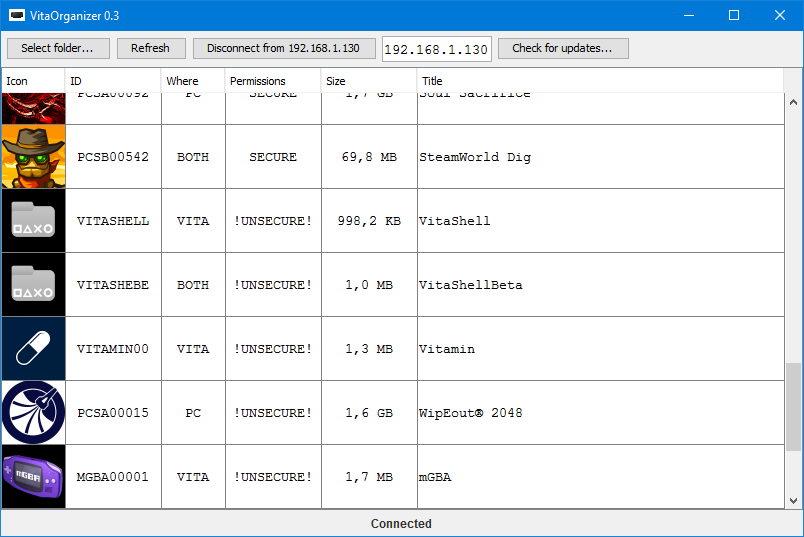

## VitaOrganizer 0.3



Desktop tool for listing and uploading games and homebrew applications to PSVITA without the size requirements
of uploading the whole VPK and extracting it later.

It is written in Kotlin/Java.

It should work on Windows, Linux and MacOS. It is a Java desktop application, packed in an executable .JAR, that
can be executed directly with double click on most cases.

In other cases, you can run it with `java -jar vitaorganizer-0.3.jar`

You can download a prebuild binary here, or just build from source:
[Download VitaOrganizer 0.3 here](https://github.com/soywiz/vitaorganizer/releases/download/0.3/vitaorganizer-0.3.jar)

## CHANGELOG

**0.3**

* Fixes size of games in psvita (please delete vitaorganizer/cache folder)
* Fixed paths in windows
* Allow column sorting
* Improved error reporting

### Building from source

You can open build.gradle in intelliJ IDEA 2016.2 (Community Edition is ok) to get started directly.
The main class is defined in : `src/com/soywiz/vitaorganizer/VitaOrganizer.kt`

You can compile without intelliJ directly from the console just with gradle. Just call

```
gradle jar
```

It will generate the file `build/libs/vitaorganizer-VERSION.jar` with all the dependencies included as an executable jar
that should work on desktop java versions.

In order to generate a native windows executable:

```
gradle launch4j
```

It will generate the file `build/libs/vitaorganizer-VERSION.exe`. It uses launch4j as launcher,
and proguard for minimizing all the files so the executable will be smaller.

### Translations

VitaOrganizer supports localization. You can fork the project and create/update files in resources/translations.

Each translation can be found here:
```
resources/translations/<ISO 639-1>.properties
```

So:
```
resources/translations/en.properties - English
resources/translations/es.properties - Spanish
resources/translations/fr.properties - French
...
```

You can find the complete list here: https://en.wikipedia.org/wiki/List_of_ISO_639-2_codes

In order to test several languages, you can launch the JVM with the following arguments:
```
-Duser.country=ES -Duser.language=es
```

Each supported text is defined in `src/com/soywiz/vitaorganizer/i18n/Texts.kt`
Texts are identified by an ID, that is the name of the variable defined in Texts class.
When translating the program tries to load the property language file from your current operating system language,
then tries to load texts in english, and if it can't find any suitable language file, it displays the ID of the text.

All files are in UTF-8 encoding.
