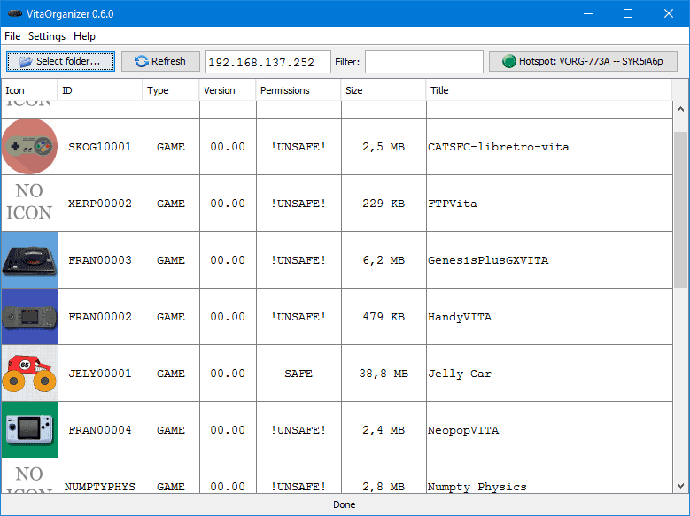

## VitaOrganizer 0.6.0



[](https://travis-ci.org/vitaorganizer/vitaorganizer)

Desktop tool for listing and uploading games and homebrew applications to PSVITA without the size requirements
of uploading the whole VPK and extracting it later.

It is written in Kotlin/Java.

It should work on Windows, Linux and MacOS. It is a Java desktop application, packed in an executable .JAR, that
can be executed directly with double click on most cases.

In other cases, you can run it with `java -jar vitaorganizer-0.6.0.jar`

You can download a prebuild binary here, or just build from source:
[Download VitaOrganizer 0.6.0 here](https://github.com/vitaorganizer/vitaorganizer/releases/tag/0.6.0)

## CHANGELOG

**0.6.0**

* [new] Hotspot feature (just for windows) [quickly create a unique wifi hostednetwork with a SSID and PASS directly from the app for direct sending without Internet connection]
* [new] Added support for converting maidumptool backups into vpk
* [new] Added support for installing some maidumptool backups that were not working previously
* [new] Support update vpks + several versions with the same TITLE_ID
* [new] Display path in context menu
* [new] New icons
* [new] New cache system
* [fixed] Show vpks without icons
* [fixed] Deleting vpk after installing
* [fixed] Fixed compression level that was compression method
* [fixed] Not reporting progress when indexing vpks
* [removed] Temporarily deleted display device games
* [improved] Notice when closing if there is a task running
* [improved] Allow opening several PSF files at once
* [improved] Moved old two-pass installation method into a submenu so it is harder to access
* [improved] Improved popup context menu
* Some refactorings
* Some reliability fixes
* Some translation updates

Thanks to gordon0001 for continuing the work these weeks!

**0.5.2**

* Added a couple of new texts (MENU_INSTALL_VPK and STEP_SENDING_GAME_UPLOADING)
* Updated STEP_UPLOADING_VPK_FOR_PROMOTING supporting %speed%
* Fixed install in 1-step that was broken in 0.5.1
* Fixed installing vpk without connecting to psvita previously (that was trying to connect to fixed 192.168.1.130)
* Added File - Install VPK option to be able to install not listed VPK
* Capitalized languages in menus
* Small fixes, improvements and cleanups

~0.5.1~ (Do not use, it has known issues) (use 0.5.2 instead)

* Added language menu
* Fixed languages that were displayed wrong (use 0.5.2 instead)
* Small internal improvements

~0.5~ (Do not use, it has known issues)

* Filtering feature
* Dumper Version/Compression Level display
* About dialog
* Added 2 level of subdirectories
* More translations

**0.4**

* Improved row selection
* Supported translations (please, go to github if you want to translate to your own language)
* Show file in explorer/finder
* Show PSF dialog
* Version column useful for homebrew
* Repack : Compression 9 + Remove duplicates + Make it safe (for backups done with older versions of vitamin, or homebrew done with older versions of vitasdk or without -s but that do not require special permissions)
* Queue tasks (not displaying yet, but already allows to queue)
* Added menus that will provide more features in future versions
* Lots of internal improvements

**0.3**

* Fixes size of games in psvita (please delete vitaorganizer/cache folder)
* Fixed paths in windows
* Allow column sorting
* Improved error reporting

### Building from source

You can open build.gradle in intelliJ IDEA 2016.2 (Community Edition is ok) to get started directly.
The main class is defined in : `src/com/soywiz/vitaorganizer/VitaOrganizer.kt`

You can compile without intelliJ directly from the console just with gradle. Just call

```
gradle jar
```

It will generate the file `build/libs/vitaorganizer-VERSION.jar` with all the dependencies included as an executable jar
that should work on desktop java versions.

In order to generate a native windows executable:

```
gradle clean minimizedJar launch4j
```

It will generate the file `build/libs/vitaorganizer-VERSION.exe`. It uses launch4j as launcher,
and proguard for minimizing all the files so the executable will be smaller.

### Translations

VitaOrganizer supports localization. It uses the default ResourceBundle java system. It includes intelliJ support.
You can edit/create: `resources/com/soywiz/vitaorganizer/Texts_*.properties` files in order to translate the application.
You can edit those files easily using intelliJ. More information: https://www.jetbrains.com/help/idea/2016.2/editing-resource-bundle.html
Texts are referenced into intelliJ easily and allows to find back references.

In order to test several languages, you can launch the JVM with the following arguments:
```
-Duser.country=ES -Duser.language=es
```
